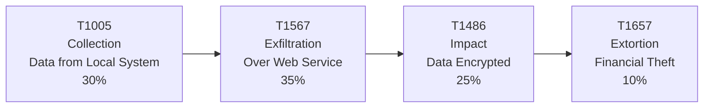

**Group Members-** Hen Golyan and Noga Menahem

**sourse Link-** *The German Cyber Criminal Überfall: Shifts in Europe's Data Leak Landscape* (https://cloud.google.com/blog/topics/threat-intelligence/europe-data-leak-landscape).

**short Attack Summary-**
The German Cyber Criminal Überfall report describes a significant rise in ransomware and data extortion attacks targeting German organizations during 2025. 
Groups such as SafePay and Qilin stole sensitive data before encrypting victims’ systems and demanding ransom payments. 
The attacks followed a double-extortion model, where attackers threatened to publish stolen information if the ransom was not paid. 
According to the MITRE ATT&CK framework, the most significant techniques used were Data from Local System (T1005), Exfiltration Over Web Service (T1567), Data Encrypted for Impact (T1486), and Financial Theft/Extortion (T1657). 
These techniques show that the attackers focused primarily on stealing valuable information and maximizing pressure on victims through both encryption and public exposure. 
This campaign highlights the growing sophistication of modern ransomware groups and the importance of protecting sensitive data, maintaining secure backups, and preparing effective incident response plans.

| Threat Group       | MITRE Group ID                                        |
|--------------------|-------------------------------------------------------|
| **SafePay**        | **N/A** (Not currently listed in MITRE ATT&CK Groups) |
| **Qilin (Agenda)** | **N/A** (Not currently listed in MITRE ATT&CK Groups) |

**Attack Diagram-**

Why these four techniques?
- T1005 enables attackers to gather valuable information.

- T1567 is the core of the double-extortion strategy by stealing the data.

- T1486 causes operational disruption through ransomware.

- T1657 pressures victims into paying by threatening public disclosure.

**MITRE ATT&CK Mapping**-
| Tactic | Technique | Behavior | ATT&CK |
|--------|-----------|----------|--------|
| Collection | T1005 – Data from Local System | Collects sensitive files before ransomware deployment. | [T1005](https://attack.mitre.org/techniques/T1005/) |
| Exfiltration | T1567 – Exfiltration Over Web Service | Transfers stolen data to attacker-controlled servers. | [T1567](https://attack.mitre.org/techniques/T1567/) |
| Impact | T1486 – Data Encrypted for Impact | Encrypts systems and files to disrupt operations. | [T1486](https://attack.mitre.org/techniques/T1486/) |
| Impact | T1657 – Financial Theft / Extortion | Threatens to publish stolen data unless ransom is paid. | [T1657](https://attack.mitre.org/techniques/T1657/) |

**What We Learned**-
This attack demonstrates how modern ransomware groups combine data theft, encryption, and extortion to maximize pressure on victims. 
It highlights the importance of protecting sensitive data, maintaining secure backups, and implementing strong cybersecurity defenses to reduce the impact of such attacks.

